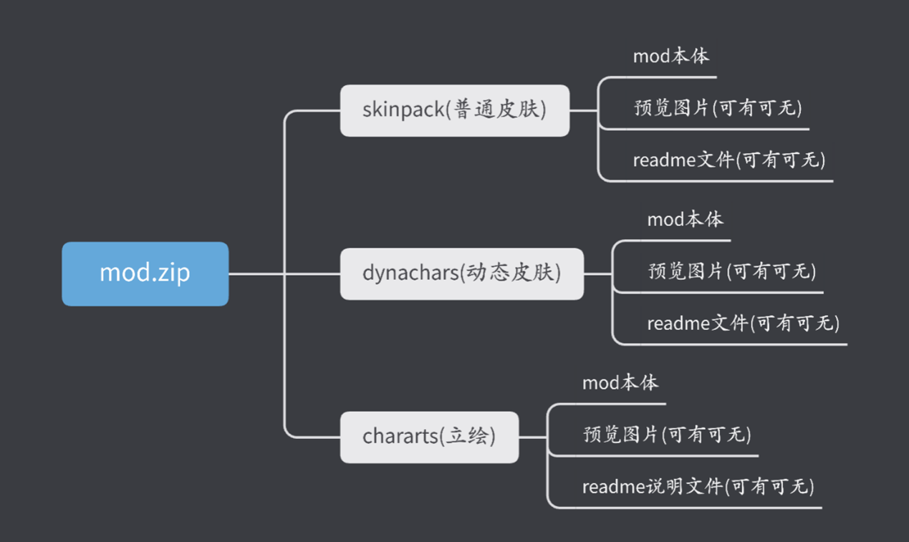

# Mod实验室

# 写在前面

**本软件与官方无任何关系，如果侵犯到你的权益请联系我删除**

**使用本软件造成的一切后果与开发者无关，请低调使用软件，不要跳脸官方**

**本人水平有限，代码写的稀烂，仅为实现功能，如果你有更好的实现方式或者有Bug反馈，请提交issues**

**本软件不提供任何Mod文件，请自行寻找**

## 已实现功能

> **目前实验室已经对安卓7-14进行适配，除了安卓14之外不在强制使用shizuku**

1. [X] 扫描QQ下载目录中的Mod
2. [X] 扫描系统Download目录中的Mod
3. [X] 一键开启反和谐
4. [X] 支持加密Mod
5. [X] 支持Mod预览
6. [X] 支持在Mod中添加作者信息（详见[MOD打包](#MOD打包)）
7. [X] 支持任意的Mod打包方式，例如多级目录，不在局限于单一形式（详见[Mod打包部分](#MOD打包)）
8. [X] 支持一个压缩文件中打包多个不同Mod（详见[Mod打包部分](#MOD打包)）
9. [X] 支持自定义游戏配置文件（详见[自定义游戏部分](#添加自定义游戏)）
10. [X] 支持常见压缩包格式如7z、rar、zip
11. [X] 支持批量管理MOD

    > **关于特殊游戏打包说明，例如明日方舟、碧蓝航线等游戏（当游戏中多个目录存在同名文件时打包方式有所变化，见[特殊MOD打包说明](#特殊MOD打包说明)）**
    >

     **

## 软件使用说明

**[点击下载](https://github.com/laoxinH/crosscore-mod-manager/releases)最新的Mod实验室**

**运行界面（安卓14使用实验室需要shizuku授权，如果不知道怎么使用shizuku请参考[shizuku官方使用说明](https://shizuku.rikka.app/zh-hans/guide/setup/#%E9%80%9A%E8%BF%87%E6%97%A0%E7%BA%BF%E8%B0%83%E8%AF%95%E5%90%AF%E5%8A%A8)）**


- **首次运行打开Mod页面会请仔细阅读后点击*同意并授权*才能继续使用软件**
- **授权后需要打开Mod页面点击刷新将会扫描Mod**
- **默认扫描控制台*配置的Mod目录*，需要扫描QQ目录和系统下载目录请去控制台开启**
- **扫描的的Mod会自动移动到配置的Mod目录，方便管理**
- **新曾Mod建议直接放置到配置的Mod目录**
- ~~在设置页面可以点击给作者买杯卡布奇洛支持一下~~

## MOD打包

**注意打包MOD如果使用ZIP格式压缩请不要使用中文密码，RAR和7z无所谓**

**注意打包MOD如果使用ZIP格式压缩请不要使用中文密码，RAR和7z无所谓**

**注意打包MOD如果使用ZIP格式压缩请不要使用中文密码，RAR和7z无所谓**

- [X] **MOD压缩文件推荐结构**


- **如果不存在readme文件，MOD实验室会提示：未适配MOD管理器，可能存在未知问题**

**readme.txt文件内容示例**


名称：刃齿爱心眼小玩具
描述：替换默认和动画
作者：laoxin
版本：1.0

**注意冒号为中文标点**

- [X] 支持一个压缩包打包多份MOD


- **MOD实验室判断不同MOD的标准之一就是以文件夹区分**
- **在实验中显示的MOD名称将会是压缩文件名（文件夹名称），如果存在readme.txt文件将会显示其中的名称**
- **压缩在同一份压缩文件中的MOD都可以存在一份readme文件用于描述，例如在testmod1和testmod2都可以存在readme文件**
- **支持多级目录，但是不推荐**
- **一个推荐的方案是将mod文件（必须存在），预览图（可有可无，推荐添加）、readme（可有可无，推荐添加）三类文件放置到同一个文件夹中**
- **支持加密压缩文件，注意加密后将无法预览MOD详细信息，谨慎使用**

## 特殊MOD打包说明

> **关于明日方舟、碧蓝航线等存在不同目录中有重名文件的情况下，mod打包的特殊说明**

由于明日方舟的游戏目录下，skinpack和character这两个文件夹中存在同名的游戏文件，如果直接按照“mod打包”的说明进行打包mod，会导致软件无法正常识别你的mod。

**现在特别说明针对此类情况的mod打包方法。此类情况mod文件打包格式为:**



你需要在mod.zip里额外创建一个和你的mod类型对应的文件夹，再在里面存放mod本体，预览图和自述文件等内容。这样就可以使得软件可以正确识别到mod。

## 添加自定义游戏

### 1. 自定义游戏配置文件

配置文件是json格式

> **文件类容如下（可以参照碧蓝航线的示例配置修改）：**

```json
{
  "gameName": "明日方舟",   // 必须填一个名字
  "serviceName": "B服-配置2.0",  // 必须填一个服务器名字
  "packageName": "com.hypergryph.arknights.bilibili",
  "version": "2.0.0", // 配置文件版本
  "gamePath": "Android/data/com.hypergryph.arknights.bilibili/", // 游戏的data目录
  "antiHarmonyFile": "",   // 反和谐文件路径，没有就不填
  "antiHarmonyContent": "", // 写入到反和谐文件中的内容,换行使用\n ，这两个反和谐配置没有则留空即可()空字符串"")没有不填
  // 用于替换mod文件的目录
  "gameFilePath": [
    "Android/data/com.hypergryph.arknights.bilibili/files/AB/Android/chararts/",
    "Android/data/com.hypergryph.arknights.bilibili/files/AB/Android/skinpack/",
    "Android/data/com.hypergryph.arknights.bilibili/files/AB/Android/arts/dynchars/",
    "Android/data/com.hypergryph.arknights.bilibili/files/AB/Android/avg/characters/",
    "Android/data/com.hypergryph.arknights.bilibili/files/AB/Android/avg/imgs/",
    "Android/data/com.hypergryph.arknights.bilibili/files/AB/Android/spritepack/",
    "Android/data/com.hypergryph.arknights.bilibili/files/AB/Android/refs/",
    "Android/data/com.hypergryph.arknights.bilibili/files/AB/Android/ui/rglktopic/",
    "Android/data/com.hypergryph.arknights.bilibili/files/AB/Android/arts/ui/namecardskin/",
    "Android/data/com.hypergryph.arknights.bilibili/files/AB/Android/battle/prefabs/enemies/",
    "Android/data/com.hypergryph.arknights.bilibili/files/AB/Android/battle/prefabs/effects/"
  ],
  // mod类型类必须和gameFilePath中的目录一一对应,可以是中文
  "modType": [
    "普通立绘",
    "静态皮肤",
    "动态皮肤",
    "剧情立绘",
    "剧情cg",
    "肉鸽道具贴图",
    "界面ui素材",
    "肉鸽主题背景",
    "个人名片背景",
    "敌人修改",
    "效果修改"
  ],
  "modSavePath": "",
  "isGameFileRepeat": true,
  "enableBackup": true,
  "tips": "注意如果此前自行修改过游戏文件，可能会出现反检测失败导致无法正常使用MOD，建议先清除游戏数据重新下载游戏资源后再使用MOD，如果出现反检测失败无论此前更改过游戏文件都需要重新下载游戏资源！"
}
// 注意当"isGameFileRepeat"为true时,压缩包内mod文件必须放到gameFilePath最后的路径
// 比如"Android/data/com.hypergryph.arknights.bilibili/files/AB/Android/refs/",这个gameFilePath中要想扫描到mod
// 必须在压缩包内存在"refs"文件夹,将用于替换这个游戏路径内的mod文件放入其中
```

> 命名为*`xxx.json`*放入MOD实验 `配置的MOD目录`里的 `GameConfig`文件夹，再到设置中点击 `读取游戏配置`，然后点击 `选择游戏`即可出
